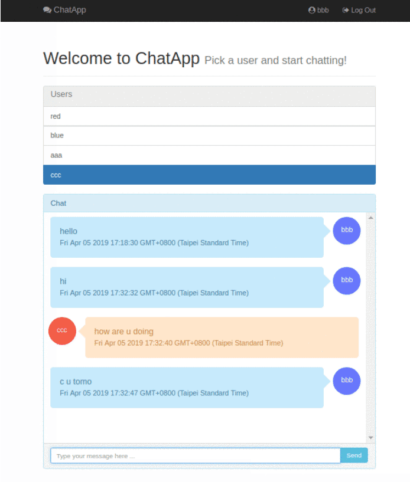
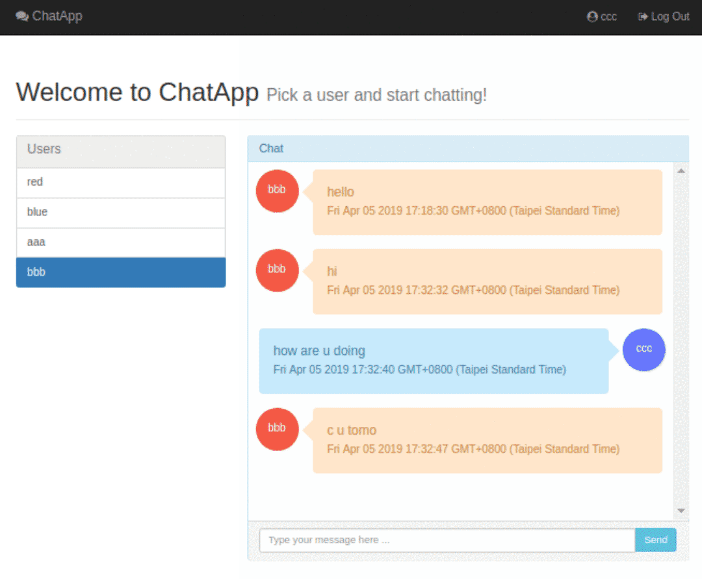

# ChatApp

A small functional person-to-person message center application built using Django. It has a REST API and uses WebSockets
to notify clients of new messages and avoid polling.

## Architecture

- When a user logs in, the frontend downloads the user list and opens a Websocket connection to the server (
  notifications channel).
- When a user selects another user to chat, the frontend downloads the latest 15 messages (see settings) they've
  exchanged.
- When a user sends a message, the frontend sends a POST to the REST API, then Django saves the message and notifies the
  users involved using the Websocket connection (sends the new message ID).
- When the frontend receives a new message notification (with the message ID), it performs a GET query to the API to
  download the received message.

## Scaling ##

### Requests ###

"Because Channels takes Django into a multi-process model, you no longer run everything in one process along with a WSGI
server (of course, you’re still free to do that if you don’t want to use Channels). Instead, you run one or more
interface servers, and one or more worker servers, connected by that channel layer you configured earlier."

In this case, I'm using the In-Memory channel system, but could be changed to the Redis backend to improve performance
and spawn multiple workers in a distributed environment.

Please take a look at the link below for more information:
https://channels.readthedocs.io/en/latest/introduction.html

- using pipenv for package management
- move to Channels 2
- use redis as the channel layer backing store. for more information, please
  check [channels_redis](https://github.com/django/channels_redis)

### Database ###

For this demo, I'm using a simple MySQL setup. If more performance is required, a MySQL cluster / shard could be
deployed.

PD: I'm using indexes to improve performance.

## Assumptions ##

Because of time constraints this project lacks of:

- User Sign-In / Forgot Password
- User Selector Pagination
- Good Test Coverage
- Better Comments / Documentation Strings
- Frontend Tests
- Modern Frontend Framework (like React)
- Frontend Package (automatic lintin, building and minification)
- Proper UX / UI design (looks plain bootstrap)

---
# Final Product

### Mobile View ###

### WEB View ###

----
# 🔗 Links - Rana Ahtsham

